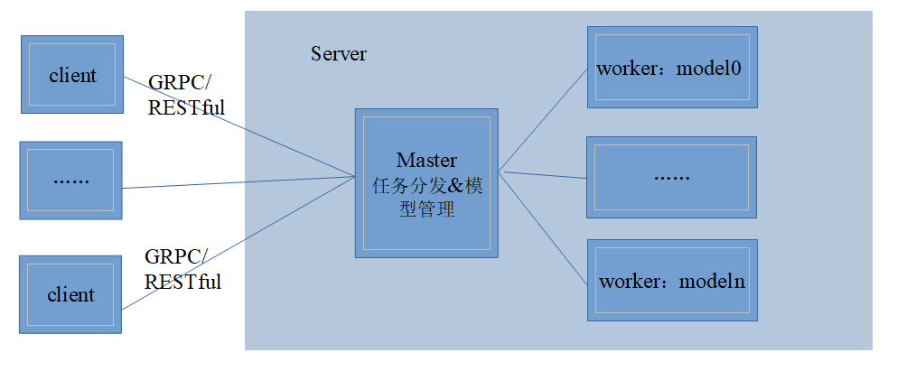

# MindSpore Serving

[查看中文](./README_CN.md)

<!-- TOC -->

- [MindSpore Serving](#mindspore-serving)
    - [Overview](#overview)
    - [Installation](#installation)
        - [Installing Serving](#installing-serving)
        - [Configuring Environment Variables](#configuring-environment-variables)
    - [Quick Start](#quick-start)
    - [Documents](#documents)
        - [Developer Guide](#developer-guide)
    - [Community](#community)
        - [Governance](#governance)
        - [Communication](#communication)
    - [Contributions](#contributions)
    - [Release Notes](#release-notes)
    - [License](#license)

<!-- /TOC -->

## Overview

MindSpore Serving is a lightweight and high-performance service module that helps MindSpore developers efficiently
deploy online inference services in the production environment. After completing model training on MindSpore, you can
export the MindSpore model and use MindSpore Serving to create an inference service for the model.

MindSpore Serving architecture:

MindSpore Serving includes two parts: `Client` and `Server`. On a `Client` node, you can deliver inference service
commands through the gRPC or RESTful API. The `Server` consists of a `Main` node and one or more `Worker` nodes.
The `Main` node manages all `Worker` nodes and their model information, accepts user requests from `Client`s, and
distributes the requests to `Worker` nodes. `Servable` is deployed on a worker node, indicates a single model or a
combination of multiple models and can provide different services in various methods. `

On the server side, when [MindSpore](#https://www.mindspore.cn/) is used as the inference backend,, MindSpore Serving
supports the Ascend 910/710/310 and Nvidia GPU environments. When [MindSpore Lite](#https://www.mindspore.cn/lite) is
used as the inference backend, MindSpore Serving supports Ascend 310, Nvidia GPU and CPU environments. Client` does not
depend on specific hardware platforms.

MindSpore Serving provides the following functions:

- gRPC and RESTful APIs on clients
- Pre-processing and post-processing of assembled models
- Batch. Multiple instance requests are split and combined to meet the `batch size` requirement of the model.
- Simple Python APIs on clients
- The multi-model combination is supported. The multi-model combination and single-model scenarios use the same set of
  interfaces.
- Distributed model inference

## Installation

For details about how to install and configure MindSpore Serving, see the [MindSpore Serving installation page](https://www.mindspore.cn/serving/docs/en/master/serving_install.html).

## Quick Start

[MindSpore-based Inference Service Deployment](https://www.mindspore.cn/serving/docs/en/master/serving_example.html) is
used to demonstrate how to use MindSpore Serving.

## Documents

### Developer Guide

- [gRPC-based MindSpore Serving Access](https://www.mindspore.cn/serving/docs/en/master/serving_grpc.html)
- [RESTful-based MindSpore Serving Access](https://www.mindspore.cn/serving/docs/en/master/serving_restful.html)
- [Services Provided Through Model Configuration](https://www.mindspore.cn/serving/docs/en/master/serving_model.html)
- [Services Composed of Multiple Models](https://www.mindspore.cn/serving/docs/en/master/serving_model.html#services-composed-of-multiple-models)
- [MindSpore Serving-based Distributed Inference Service Deployment](https://www.mindspore.cn/serving/docs/en/master/serving_distributed_example.html)

For more details about the installation guide, tutorials, and APIs,
see [MindSpore Python API](https://www.mindspore.cn/serving/api/en/master/index.html).

## Community

### Governance

[MindSpore Open Governance](https://gitee.com/mindspore/community/blob/master/governance.md)

### Communication

- [MindSpore Slack](https://join.slack.com/t/mindspore/shared_invite/zt-dgk65rli-3ex4xvS4wHX7UDmsQmfu8w) developer
  communication platform

## Contributions

Welcome to MindSpore contribution.

## Release Notes

[RELEASE](RELEASE.md)

## License

[Apache License 2.0](LICENSE)
