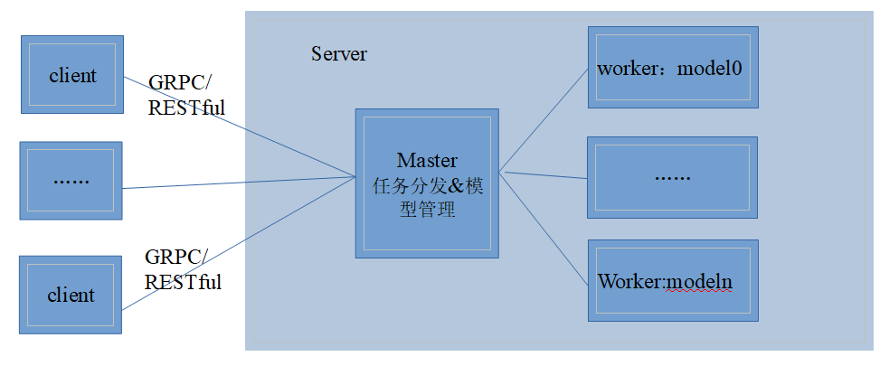

# MindSpore Serving

[View English](./README.md)

<!-- TOC -->

- [MindSpore Serving](#mindspore-serving)
  - [概述](#概述)
  - [安装](#安装)
    - [安装Serving](#安装serving)
    - [配置环境变量](#配置环境变量)
  - [快速入门](#快速入门)
  - [文档](#文档)
    - [开发者教程](#开发者教程)
  - [社区](#社区)
    - [治理](#治理)
    - [交流](#交流)
  - [贡献](#贡献)
  - [版本说明](#版本说明)
  - [许可证](#许可证)

<!-- /TOC -->

## 概述

MindSpore Serving是一个轻量级、高性能的服务模块，旨在帮助MindSpore开发者在生产环境中高效部署在线推理服务。当用户使用MindSpore完成模型训练后，导出MindSpore模型，即可使用MindSpore Serving创建该模型的推理服务。  

**MindSpore Serving架构：**

当前MindSpore Serving服务节点分为client，master和worker。client为用户节点，下发推理服务命令。执行机worker部署了模型服务。当前仅支持Ascend 310和Ascend 910，后续会逐步支持GPU和CPU场景。master节点用来管理所有的执行机worker及其部署的模型信息，并进行任务管理与分发。master和worker可以部署在一个进程中，也可以部署在不同进程中。  


MindSpore Serving提供以下功能：

- 支持客户端gRPC和RESTful接口
- 支持组装模型的前处理和后处理
- 支持batch功能
- 提供客户端python简易接口

## 安装

MindSpore Serving依赖MindSpore训练推理框架，安装完[MindSpore](https://gitee.com/mindspore/mindspore#%E5%AE%89%E8%A3%85) ，再安装MindSpore Serving。

### 安装Serving

使用pip命令安装，安装方式如下：

- 请从MindSpore Serving下载页面下载并安装whl包。

```python
pip install https://ms-release.obs.cn-north-4.myhuaweicloud.com/1.1.0/Serving/ascend/ubuntu_x86/mindspore_serving-1.1.0-cp37-cp37m-linux_x86_64.whl
```

- 2、源码编译安装。

下载[源码](https://gitee.com/mindspore/serving)，下载后进入`serving`目录。

方式一，指定Serving依赖的已安装或编译的MindSpore包路径，安装Serving：

```shell
sh build.sh -p $MINDSPORE_LIB_PATH
```

其中，`build.sh`为`serving`目录下的编译脚本文件，`$MINDSPORE_LIB_PATH`为MindSpore软件包的安装路径下的lib路径，例：`softwarepath/mindspore/lib`，该路径包含MindSpore运行依赖的库文件。

方式二，直接编译Serving，编译时会配套编译MindSpore的包，需要配置MindSpore编译时的[环境变量](https://gitee.com/mindspore/docs/blob/master/install/mindspore_ascend_install_source.md#配置环境变量) ：

```shell
# ascend 310
sh build.sh -e d -V 310
# ascend 910
sh build.sh -e accend
```

其中，`build.sh`为`serving`目录下的编译脚本文件，编译完后，在`serving/build/package/`目录下找到whl安装包进行安装：

```python
pip install mindspore_serving-1.1.0-cp37-cp37m-linux_x86_64.whl
```

执行以下命令，验证安装结果。导入python模块不报错即安装成功：

```python
from mindspore_serving import master
from mindspore_serving import worker
```

### 配置环境变量

MindSpore Serving运行需要配置以下环境变量：

- MindSpore Serving依赖MindSpore正确运行，运行MindSpore需要完成[环境变量配置](https://gitee.com/mindspore/docs/blob/master/install/mindspore_ascend_install_pip.md#%E9%85%8D%E7%BD%AE%E7%8E%AF%E5%A2%83%E5%8F%98%E9%87%8F)。

- MindSpore Serving依赖MindSpore库文件，需指定MindSpore软件包的编译或安装路径下的`lib`路径到LD_LIBRARY_PATH。

```shell
export LD_LIBRARY_PATH=$MINDSPORE_LIB_PATH:${LD_LIBRARY_PATH}
```

## 快速入门

以一个简单的[Add网络示例](docs/example.md)，演示MindSpore Serving如何使用。

## 文档

### 开发者教程

- [gRPC接口使用说明](docs/GRPC.md)
- [RESTful接口使用说明](docs/RESTful.md)
- [模型配置接口使用说明](docs/MODEL.md)

有关安装指南、教程和API的更多详细信息，请参阅[用户文档](https://gitee.com/mindspore/serving/tree/master/docs)。

## 社区

### 治理

查看MindSpore如何进行[开放治理](https://gitee.com/mindspore/community/blob/master/governance.md)。

### 交流

- [MindSpore Slack](https://join.slack.com/t/mindspore/shared_invite/zt-dgk65rli-3ex4xvS4wHX7UDmsQmfu8w) 开发者交流平台。
- `#mindspore`IRC频道（仅用于会议记录）
- 视频会议：待定
- 邮件列表：<https://mailweb.mindspore.cn/postorius/lists>

## 贡献

欢迎参与贡献。

## 版本说明

版本说明请参阅[RELEASE](RELEASE.md)。

## 许可证

[Apache License 2.0](LICENSE)
